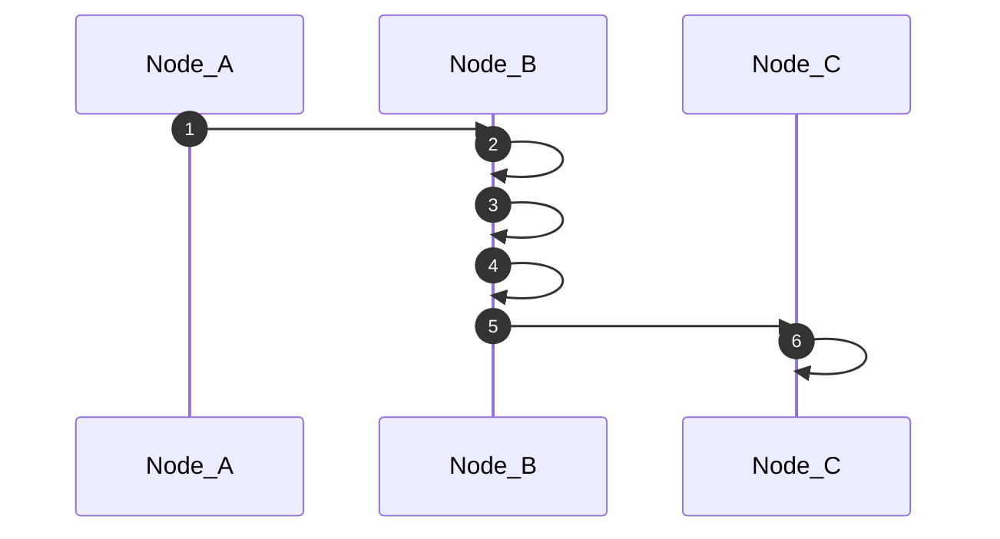

# hybrid logical clock

![badge][badge-android]
![badge][badge-jvm]
![badge][badge-js]
![badge][badge-ios]
![badge][badge-linux]
![badge][badge-windows]
![badge][badge-mac]

A Kotlin multiplatform implementation of a [hybrid logical clock](https://cse.buffalo.edu/tech-reports/2014-04.pdf)

# Overview

Technically speaking this is an implementation of a HULC [Hybrid Unique Logical Clock]

It combines:

- A system timestamp (Epoch millis)
- A counter (Lamport Clock)
- A unique identifier (First 16 chars of a uuid v4)

To produce a unique monotonic timestamp which looks like the following when serialised

`000943920000000:0000f:abcda554fcb2613b`


As with all logical clocks, the clock "_ticks_"/"_tocks_" with events, by this I mean operations to advance the clock surround the exchange of information between nodes in the system.

Hybrid Logical Clocks overcome issues that traditional system clock based timestamps suffer from in disributed environments, notably:

- Duplicate timestamps, its entirely possible two nodes generate an event in the same second/millisecond
- Drift, its easy for nodes system clocks to get out of sync, even in environments with protocols like NTP


# Logical Clocks

At the heart of a HLC is a counter / logical clock


The most famous logical clock is a [Lamport Clock](https://en.wikipedia.org/wiki/Lamport_timestamp), Lamport clocks determine the causality of events amongst nodes in a distributed system by observing:

- Events generated on a single node
- The exchange (sending and receiving) of events between nodes

For example in the diagram below, we know that event 6 happened after event 1 despite the fact they occurred on different nodes.



The algorithm behind lamport clocks is quite simple

- A node increments its counter before each local event (e.g., message sending event);
- When a node sends a message, it includes its counter value with the message after executing step 1;
- On receiving a message, the counter of the recipient is updated, if necessary, to the greater of its current counter and the timestamp in the received message. The counter is then incremented by 1 before the message is considered received.

# Hybrid Logical Clocks

Whilst HLCs observe the same events as Lamport Clocks to determine causality, they use a composite of elements to create their timestamps.

`000943920000000:0000f:abcda554fcb2613b`

This provides all the causality assurances of logical clocks, with the human readability of system clocks and the uniqueness of uuids.


# Usage

### Creation

On each node that is a writer (i.e. can create events) create a clock.

```kotlin
// You should only ever have one source of truth for your local hlc, so it's advisable to store it in a singleton.
var local = HybridLogicalClock()
```

As the clock contains a uuid portion of its composite, you can consider the clock a datastore for the nodes identifier.

To access the identifier simply call

```kotlin
val nodeId = local.node
```

### Persistance 

The clock must survive process death and continue where it left after reboot, you can easily serialise the clock to disk
with the help of the encode/decode functions.

```kotlin
val saveMeToDisk = HybridLogicalClock.encodeToString(local) 
```

Decoding can produce errors and thus a Result monad is returned

```kotlin
val result = HybridLogicalClock.decodeFromString(encoded)
```
### Advancing the clock, "tick", "tock"

When generating local events increment the clock, the result is your new clock and also the timestamp for that local event 

```kotlin
HybridLogicalClock.localTick(local).let { updated ->
    local = updated
    event.timestamp = updated
}
```

When receiving events from external nodes update the clock

```kotlin
val remote = event.hlc
local = HybridLogicalClock.remoteTock(local, remote)
```

### Comparing

HybridLogicalClocks implement the Kotlin Comparable interface, and thus you can simply

```kotlin
val winner = hlc1 > hlc2
```

## Acknowledgments 


[badge-android]: http://img.shields.io/badge/-android-6EDB8D.svg?style=flat
[badge-jvm]: http://img.shields.io/badge/-jvm-DB413D.svg?style=flat
[badge-js]: http://img.shields.io/badge/-js-F8DB5D.svg?style=flat
[badge-linux]: http://img.shields.io/badge/-linux-2D3F6C.svg?style=flat
[badge-windows]: http://img.shields.io/badge/-windows-4D76CD.svg?style=flat
[badge-ios]: http://img.shields.io/badge/-ios-CDCDCD.svg?style=flat
[badge-mac]: http://img.shields.io/badge/-macos-111111.svg?style=flat